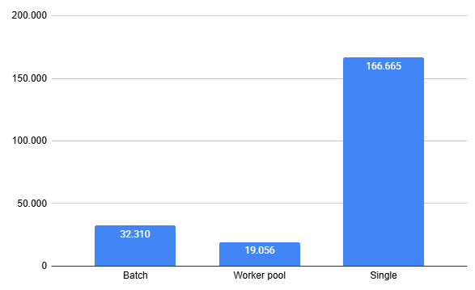

## Aplicação de exemplo para SQS com GO

Essa é uma aplicação extremamente simples usada apenas para exemplificar o consumo de mensagens usando SQS e a serialização e deserialização de dados em GO

:warning: Não leve essa arquitetura e solução no geral como a melhor para produção sem entender o contexto de onde trabalha! Isso foi feito por alguém que tem pouco contato com Golang e nunca trabalhou em um time com essa linguagem para fins que não fossem aplicações de gerenciamento de infraestrutura e templates de projetos.

### Pontos relevantes

- No pacote `messaging` são definidos templates para criação de consumers e producers do SQS além da configuração;
- No pacote `consumers` são definidos os consumers em si (Talvez isso tenha ficado meio confuso?);
- No pacote `router` a classe que dá inicio ao GIN Server (Servidor http para receber requisições) é definida;


### Branchs

- `dev:` O Consumo das mensagens é feito em modo **Single** ou seja uma mensagem processada a por vez
- `worker-pool:` As mensagens são consumidas por várias threads diferentes utilizando o conceito de pool de workers
- `Batch:` As mensagens são consumidas em lote de no máximo 10 mensagens (máximo do SQS)


### Testes com K6

No diretório `k6` existe um teste bem bobo feito para enviar requisições para o endpoint de envio de mensagens. Um exemplo simples de utilização:

:warning: Cuidado com a emoção aqui lembre-se que o SQS é pago e que se você enviar mensagens sem cuidado isso vai doer no bolso.

```sh
k6 run --vus 10 --iterations 10 .\k6.js
```

### Resultado de teste comparativo de modo de consumo

| Modo de consumo | Tempo total  |
|-----------------|--------------|
| Batch           | 32.310       |
| Worker pool     | 19.056       |
| Single          | 166.665      |



### Configurando

Adicione as variáveis abaixo:

- SQS_QUEUE_URL: Endereço da fila do SQS para onde as mensagens serão enviadas e recebidas
- AWS_ACCESS_KEY_ID: ID da chave de acesso da AWS
- AWS_SECRET_ACCESS_KEY: Chave de acesso da AWS
- AWS_REGION: Região da AWS

### Usando

1. Inicie a aplicação

```sh
go mod download
go run main.go
```

2. Envie uma requisição http

```sh
curl --location 'http://localhost:8080/deposito' \
--header 'Content-Type: application/json' \
--data '{
    "contaOrigem": "100000",
     "contaDestino": "400001",
     "valor": 1000
}'
```